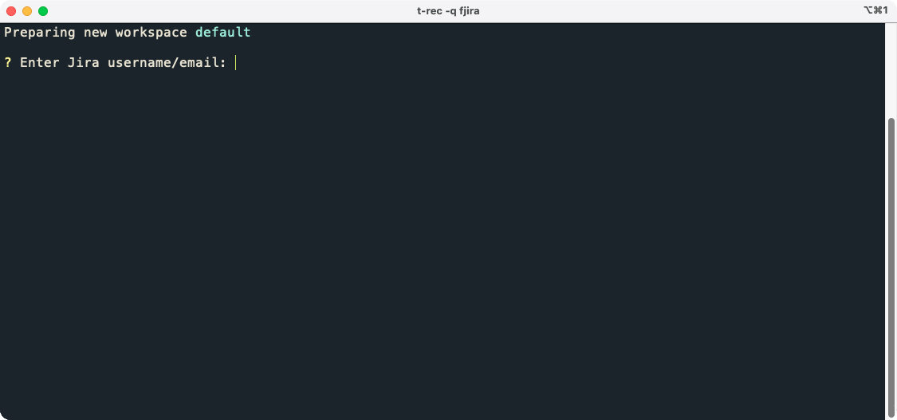

# Fjira - the fuzziest Jira command line tool in the world.


[](https://github.com/mk-5/fjira/blob/master/LICENSE)


## Demo


## Features

- Search for Jira Projects, and Issues
- Changes Jira Issue assignee
- Changes Jira Issue status
- Supports multiple workspaces
- Runs on MacOS and Linux

## Install

### Mac OS

```shell
brew tap mk-5/mk-5
brew install fjira
```

### Linux

Go to [https://github.com/mk-5/fjira/releases/latest](https://github.com/mk-5/fjira/releases/latest), and check the
latest release version.

```shell
wget https://github.com/mk-5/fjira/releases/download/0.0.1/fjira_0.0.1_Linux_x86_64.tar.gz
tar -xvzf fjira_0.0.1_Linux_x86_64.tar.gz
cp fjira /usr/local/bin/fjira
```

### Build from sources

```shell
git clone git@github.com:mk-5/fjira.git
cd fjira
./scripts/build.sh
cp fjira /usr/local/bin/fjira # or ln -s or whatever you like to do with it
```

## Usage

```text
Usage:
    fjira
    fjira [command]
    fjira [command] [flags]
    fjira [flags]
    fjira [jira-issue] [flags]

Available Commands:
    workspace               Switch fjira workspace
    help               	    Help
    version                 Show version

Flags:
    -p, --project             Open project issues search directly from CLI, example: -p GEN.
    -w, --workspace           Use different fjira workspace without switching it globally, example: -w myworkspace
    -nw, --new-workspace      Create new workspace, example: fjira --new-workspace=abc
```

## Getting Started

The CLI Jira interface is pretty straightforward. Just run `fjira` in your terminal.

```shell
fjira
```

### Workspaces

Fjira will ask you about Jira API url, and token if you run fjira for the very first time.



Fjira workspace is a set of jira configuration data, and it's store in simple json file under `~/.fjira` directory.
You can switch within multiple workspaces using `fjira workspace` command.

```shell
fjira workspace
```

It will open a fuzzy finder with all already configured workspaces.
In order to create a new workspace you need to use following command:

```shell
fjira --new-workspace=otherworkspace
```

### Projects search

The projects search is a default view, just run `fjra` in order to open it.

```shell
fjira
```

#### Open Jira project from cli

You can open a project directly from cli.

```shell
fjira --project=PROJ
```

The fjira app will skip projects search screen, and it'll go to the next screen with issues search.

## The Future (TODO)

- More docs
- Windows support
- Support Linux package managers nonsense aka. Snapcraft, Deb, AUR
- More Jira features ;)
