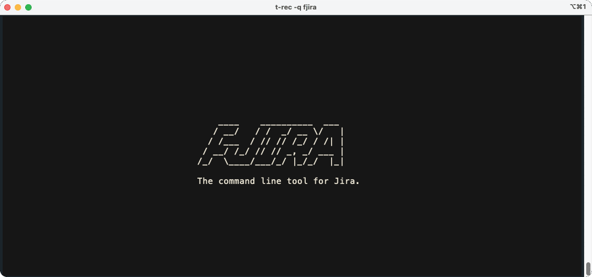

# Fjira - the fuzziest Jira command line tool in the world.


[](https://github.com/mk-5/fjira/blob/master/LICENSE)

## Demo



## Features

- Search for Jira Projects, and Issues
- Changes Jira Issue assignee
- Changes Jira Issue status
- Supports multiple workspaces
- Runs on MacOS and Linux

## Getting started

### Mac OS

```shell
brew install fjira
```

### Build from sources

```shell
git clone git@github.com:mk-5/fjira.git
cd fjira
./scripts/build.sh
cp fjira /usr/local/bin/fjira # or ln -s / or whatever you like
```

## Usage

```shell
Usage:
    fjira [command]
    fjira [flags]
    fjira [jira-issue] [flags]

Available Commands:
    workspace               Switch fjira workspace
    help               	    Help
    version                 Show version

Flags:
    -p, --project           Search for issues withing project, example: -p GEN.
    -w, --workspace         Use different fjira workspace, example: -w myworkspace
```
